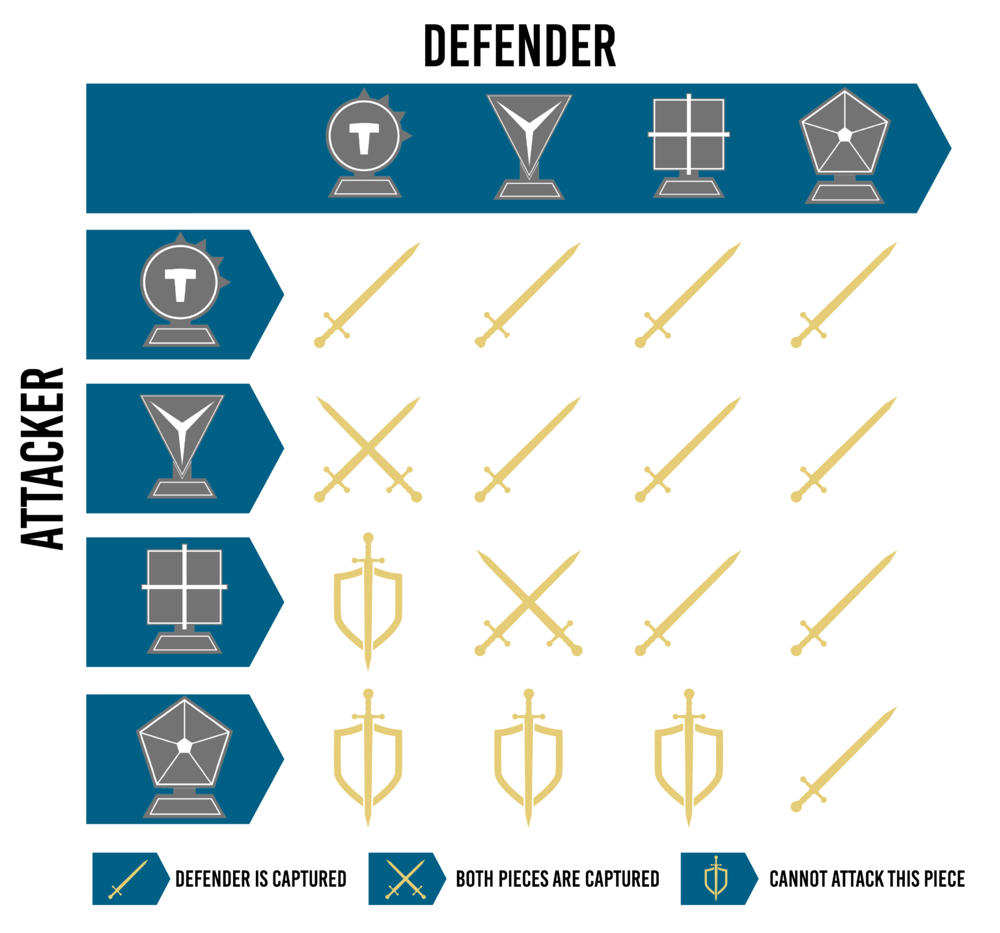
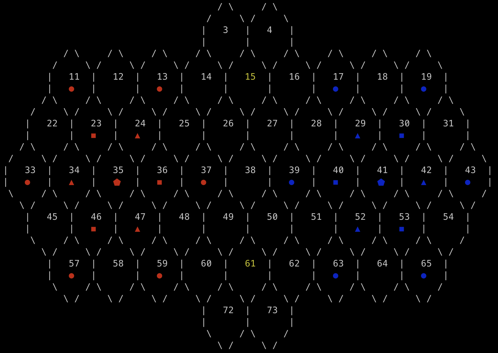

# Tactigon

## Group Tactigon_6, 3LEIC08

- Madalena Ye, up202108795@fe.up.pt (50%)
- João Torre Onofre Pereira, up202108848@fe.up.pt (50%)

## Installation and Execution

To run the program you need to have SICStus Prolog 4.8 installed.
Unzip the given zip file and run inside the Prolog interpreter:

```prolog
consult(main).
play.
```

## Description of the game

**Tactigon** is a two-player game that combines strategy with geometric shapes. It's described as a fast-paced board game where players use their strategic skills to navigate the unique board displayment. The game is characterized by its innovative approach to geometry and offers an engaging gameplay experience. Below is the unique board display of Tactigon, which differs from traditional board games:


There are four types of pieces, each one representing a shape:

-  **Circle**, can move only **one** space.
-  **Triangle**, can move up to **three** spaces.
-  **Square**, can move up to **four** spaces.
-  **Pentagon**, can move up to **five** spaces.

For any of the pieces, **movement** can be along any path and in any direction up to their maximum spaces. This means that movement doesn't have to be in straight line.
An important aspect: pieces **cannot jump** other pieces, only being able to move between free spaces or engage in combat.

During the initial setup of Tactigon, the pieces are strategically placed in pre-defined spaces on each player's side of the board.


Each player has six circles, three triangles, three squares and one pentagon.

When a player moves to a place occupied by an opponent's piece we call this a **combat**. A combat can have three outcomes depending on the pieces envolved. Check the possible outcomes in the table below:



There are two ways of **winning** the game:

1. Capturing the opponent's pentagon.
2. Occupying both gold tiles represented in the board. 
> Note that, in order to win through the 2nd method, the turn needs to end. This indicates that simply occupying the gold tiles may not suffice if the opponent can remove one of the pieces during their play.


To know more about the game read the full rule book [here](https://online.fliphtml5.com/hvuax/bvzo/) or consult the [official game website](https://tactigongame.com/).


## Game Logic

The source code is organized into distinct modules:


- `menu:` Contains all menu-related predicates and their corresponding choices.
- `game:` Encompasses all game logic, including predicates like game_cycle, choose_move and game_over.
- `board:` Defined by predicates responsible for displaying the current game state's board.
- `utils:` Includes input/output predicates and several utility predicates.
- `bfs:` Focused on the breadth-first search algorithm and its associated helper functions.
- `ai:` Devoted to the artificial intelligence components of the game.
 
### Internal Game State Representation

In our scenario, the game state is depicted by a:
- `Board:` Represented by a list of lists where each inner list corresponds to a row on the board. Within these rows, each element can be one of the three: an invalid position, an unoccupied space, or a game piece belonging to a specific player.
- `Player:` It represents the player whose it is to player, being identified as either 'r' (representing the red player on the left) or 'b' (signifying the blue player on the right).

#### Initial State
```prolog
[
    [-1,-1,-1,0,0,-1,-1,-1,-1,-1,-1],
    [r-1,0,r-1,0,0,0,b-1,0,b-1,-1,-1],
    [0,r-4,r-3,0,0,0,0,b-3,b-4,0,-1],
    [r-1,r-3,r-5,r-4,r-1,0,b-1,b-4,b-5,b-3,b-1],
    [-1,0,r-4,r-3,0,0,0,0,b-3,b-4,0],
    [-1,-1,r-1,0,r-1,0,0,0,b-1,0,b-1],
    [-1,-1,-1,-1,-1,-1,0,0,-1,-1,-1]
]
```
As showed, the board is not a perfect NxN table, so we use the value `-1` to indicate that a particular cell is not accessible or playable.
The value `0` means the space is empty, devoid of any pieces belonging to the players.
The remaining values on the board represent pieces belonging to the players. Those with prefixes such as `r-` belong to the red player, and those prefixed with `b-` pertain to the blue player. The subsequent number in each case provides information about the type of piece (based on their number of moves):
- `1` - Circle
- `3` - Triangle
- `4` - Square
- `5` - Pentagon

#### Intermediate State and Final State
> In the intermediate and final state, the board remains the same, with the sole exception being certain pieces that have either shifted their position or been captured.

#### Final State

### Game State Visualization

#### Menu 

To facilitate menu displays and enforce input validation, a specific predicate named **display_menu** was developed. This predicate manages input validation by verifying whether the provided option is included in the list of available choices, and subsequently invokes the selected predicate.

```prolog
display_menu(Lines, Actions) :-
    clear,
    write_lines(Lines), % Write options list
    length(Actions, Len),
    MaxOption is Len - 1,
    read_number_until('Choose option: ', between(0, MaxOption), Choice),
    nth0(Choice, Actions, Action), % Select selected predicate
    call(Action). % Call selected predicate
```
Example of use:
```prolog
menu :- repeat, display_menu([
    "Please select an option:",
    "1: Play",
    "2: How to play",
    "3: Exit"
], [!, play_menu, instructions_menu]).
```

#### Board visualization



Converting this game state for a visual board was not an easy task.
To put it simple, we create the game board's visual representation by printing it with the display_game(+Board) function, which involves iterating through the lines of the board. Subsequently, we traverse the line values to display the cells based on their respective values.
For instance, if the value indicates that the cell should not be visible, we should only print blank spaces.

```prolog
1.    / \     / \
2.  /     \ /     \
3. |   1   |   2   |
4. |       |   ◼   |
5.  \     / \     /      
6.    \ /     \ /      
```

Each hexagon is displayed with the help of six lines.
Lines 1, 2, 5, and 6 serve mainly for visual aesthetics and are not particularly crucial.
The third line is significant because it represents the cell number, which is determined by the summation of the product of the line number with the line size and the line's position.
`N = CurrentLine * LineSize + CurrentCell`
This number plays a key role in identifying cells for selection, as it ensures uniqueness and ease of use.

The fourth line is responsible for displaying the cell's value, which signifies the piece located in that specific board position. This is achieved using the display_cell_value predicate, which maps the value to the corresponding ASCII character.

```prolog
display_cell_value(-1) :- write(' ').
display_cell_value(0) :- write(' ').
display_cell_value(-_1) :- put_code(9711). %Code for ◯
display_cell_value(_-3) :- put_code(9651). %Code for △
(...)
```

#### Board sizes

Players have the option to select from different board sizes, including **Normal**, **Small**, and **Extra Small**. We then pass the board type/size to the predicate initial_state(+Type, -GameState) which will be then responsible for creating an initial game state.

The Normal board has already been displayed earlier. Below, you'll find representations of the Small and Extreme Small boards, respectively.

<div>
     
    
</div>


### Move Validation and Execution

#### Move Execution
Move execution is handled by the move/3 predicate.
```prolog
move(Player-Board, (Xi, Yi, Xf, Yf), NewPlayer-NewBoard) :- 
    change_player(Player, NewPlayer),
    valid_piece(Xi, Yi, Board, Player-Attacker),
    bfs((Xi,Yi), Attacker, Player, Board, Moves),
    memberchk((Xf,Yf), Moves),
    get_piece(Xf, Yf, Board, Piece),
    combat(Player-Attacker, Piece, ResultingPiece),
    implement_move((Xi, Yi, Xf, Yf), Board, ResultingPiece, NewBoard).
```
It is responsible for validating the current move in accordance with the game's rules, and if the move proves to be valid, it executes the same move, thereby generating the new state of the game. If the new move is found to be invalid, the predicate will not succeed.

A move is composed of a starting position and an ending position.

Executing the move itself is changing the value of the starting position to 0 (empty), and updating the value of the destination position to the resulting piece. It's important to note that the resulting piece may not be the same as the piece that was initially moved.

#### List of Valid Moves

**Validate Moves**

```prolog
valid_moves(Board, Player, ListOfMoves) :-
    findall((Xi,Yi,Xf,Yf), (
        valid_piece(Xi, Yi, Board, Player-Piece),
        bfs((Xi,Yi), Piece, Player, Board, Moves),
        member((Xf,Yf), Moves)
    ), ListOfMoves).
```

This predicate returns a list of all the valid moves a player can make in the current board state.

- The findall/3 predicate is used to find all valid moves for the given player. It does this by iterating over all the pieces of the player on the board, and for each piece, it performs a breadth-first search (BFS) to find all the valid moves that piece can make.
- The valid_piece/4 predicate checks if there is a valid piece belonging to the current player (Player) at position (Xi, Yi) on the board. Piece represents the piece at that position.
- Finally, member/2 checks if (Xf, Yf) (the ending position) is a member of the list of valid moves (Moves) determined by the bfs predicate.


#### Game Over
The determination of whether the game has concluded is accomplished through the game_cycle/1 predicate, which, in turn, invokes the game_over predicate for verification.
As the game can end in two distinct ways, this predicate has been declared twice to handle and verify each of these situations separately.

1. Check if any of the board pentagons was captured and return the oposite player as the Winner.
```prolog
game_cycle(Player-Board, _):-
    game_over(Player-Board, Winner), !,
    display_winner(Winner),
    menu.
    
game_over(_-Board, Winner) :-
    win_pentagon_captured(Board, Winner).
win_pentagon_captured(Board, b) :- captured(r-5, Board).
win_pentagon_captured(Board, r) :- captured(b-5, Board).
```
The `captured` predicate will iterate the board in search for the `r` or `b` pentagon.

2. The second way to win is by checking if the gold tiles are occupied by the same player. This is done by selecting both spaces and checking if it's the same player in both.
```prolog
game_over(Player-Board, Winner) :-
    win_gold_tiles(Player-Board, Winner).

win_gold_tiles(b-Board, b) :-
    get_piece(1,4, Board, b-_),
    get_piece(5,6, Board, b-_).

win_gold_tiles(r-Board, r) :-
    get_piece(1,4, Board, r-_),
    get_piece(5,6, Board, r-_).
```

### Game State Evaluation 
Evaluation of the state of the game is done using the value/3 predicate.

```prolog
% value(+Board, +Player, +RowIndex, +ColumnIndex, +AccValue, -Value)
value([], _, _, _, Value, Value). % base case
value([Row | Rest], Player, RowI, ColI, AccVal, Value) :-
    evaluate_row(Row, Player, RowI, ColI, RowVal),
    NewAccVal is RowVal + AccVal,
    NewRowI is RowI + 1,
    value(Rest, Player, NewRowI, ColI, NewAccVal, Value).

% evaluate_row(+Row, +Player, +RowIndex, +ColumnIndex, -Value)
% Evaluates the given row and returns a value.
evaluate_row([],_,_,_,0). % base case
evaluate_row([Cell | Rest], Player, RowI, ColI, RowVal) :-
    evaluate_cell(Cell, Player, RowI, ColI, CellVal),
    NewColI is ColI + 1,
    evaluate_row(Rest, Player, RowI, NewColI, RecursiveValue),
    RowVal is CellVal + RecursiveValue.
    % evaluate_cell(+Cell, +Player, +RowIndex, +ColumnIndex, -Value)
% Evaluates the given cell and returns a value.

evaluate_cell(-1,_,_,_,0) :- !. % not playable cell
evaluate_cell(0,_,_,_,0) :- !. % empty cell
evaluate_cell(P-Piece, Player, RowI, ColI, CellVal) :-
    P = Player,
    !,
    evaluate_piece(Piece, RowI, ColI, CellVal).

evaluate_cell(_-Piece,_, RowI, ColI, CellVal) :- 
    evaluate_piece(Piece, RowI, ColI, PieceVal),
    CellVal is -PieceVal.

% evaluate_piece(+Piece, +RowIndex, +ColumnIndex, -Value)
% Evaluates the given piece and returns a value.
evaluate_piece(5,_, _, 1000) :- !. % pentagon
evaluate_piece(_,1,Col,200) :-  % upper gold tile
    Col =:= 4, !.
evaluate_piece(_,5,Col,200) :-  % lower gold tile
    Col =:= 6, !.
evaluate_piece(Piece, RowI, ColI, PieceVal):-
    Dcol is abs(ColI - 5),
    Drow is abs(RowI - 3),
    Distance is Dcol + max(0, (Drow-Dcol)/2),
    Aux is 5 - Distance,
    PieceVal is Aux * Piece.
```
The predicate takes as input the Board, the current Player, and accumulates the Value. It starts with initial values of zero and then recursively calculates the value. It computes the value of the game board for a particular player by evaluating each cell, row, and ultimately, the entire board. It accounts for different piece types, their positions, and distances from the board's gold tiles to determine the board's desirability for the player.

### Computer Plays

We implemented 2 strategies of computer play, one being the "easy mode" and the other being the "hard mode".

The easy mode is done by picking a random move with the following predicate:

```prolog
% Chooses a new move for the easy AI to perform.
choose_move(Board, Player, easy_bot, (Xi, Yi, Xf, Yf)) :- 
    random_move(Board, Player, (Xi, Yi, Xf, Yf)),
    wait_for_enter.

random_move(Board, Player, (Xi, Yi, Xf, Yf)) :-
    valid_moves(Board, Player, Moves),
    random_member((Xi, Yi, Xf, Yf), Moves).
```

In hard mode, we implemented a greedy algorithm to determine the player's optimal move on the board. It begins by validating potential moves and subsequently evaluates them, taking into account factors like the value of game pieces, their positions, and their proximity to gold tiles. From these considerations, it identifies the most favorable moves and randomly selects one of them for execution.

```prolog
% greedy_move(+Board, +Player, -Move)
% Chooses the best move from the valid moves of the given board and player.
greedy_move(Board, Player, (Xi, Yi, Xf, Yf)) :-
    valid_moves(Board, Player, Moves),
    best_move(Board, Player, Moves, (Xi, Yi, Xf, Yf)).

% best_move(+Board, +Player, +Moves, -GreedyMove)
% Chooses the best move from the given list of moves.
best_move(Board, Player, Moves, GreedyMove) :-
    evaluate(Board, Player, Moves, Values),
    max_member(MaxValue, Values),
    findall((Xi, Yi, Xf, Yf), (
        nth0(X, Values, MaxValue),
        nth0(X, Moves, (Xi, Yi, Xf, Yf))
    ), BestMoves), 
    random_member(GreedyMove, BestMoves).
```

## Conclusions
Tactigon was successfully implemented in the SicStus Prolog 4.8 language. The game can be played Player vs Player, Player vs Computer or Computer vs Computer (with the Computer having 2 different levels of difficulty).

#### I/O limitations
During the game's development, we encountered certain input/output limitations. Apart from a few built-in predicates, we found them to be insufficient and quite basic. As a result, we had to create a custom predicate for obtaining numerical input from the user, which, in our view, is a fundamental and frequently required task.

#### Greedy Algorithm
The game we picked up is very complex, as the board is abnormal. The game includes numerous pieces with diverse movement capabilities, combat outcomes, and victory conditions.
We are aware that our greedy algorithm is not very efficient. This is one of the aspects the project could be improved in the future.
Our predicate evaluate_piece is not 100% correct. We use this to evaluate pieces: the closer to the center, the greater value they have. However, when implementing the coordinates system (double coordinates) we did not antecipate we had to calculate distances between hexagons. The math is not quite correct, as we did not have time to improve further on, and as a result our computer starts off the game with the same move. This happens because there is two optimal moves, but he always picks the first one, since we did not correctly calculate the distance between the hexagons.
```prolog
evaluate_piece(Piece, RowI, ColI, PieceVal):-
    Dcol is abs(ColI - 5),
    Drow is abs(RowI - 3),
    Distance is Dcol + max(0, (Drow-Dcol)/2),
    Aux is 5 - Distance,
    PieceVal is Aux * Piece.
```

## Bibliography
* https://tactigongame.com/
* https://silp.iiita.ac.in/wp-content/uploads/PROLOG.pdf
* https://www.redblobgames.com/grids/hexagons/#map-storage
* https://github.com/cmelchior/asciihexgrid
* https://www.youtube.com/watch?v=l-hh51ncgDI&t=355s&ab_channel=SebastianLague